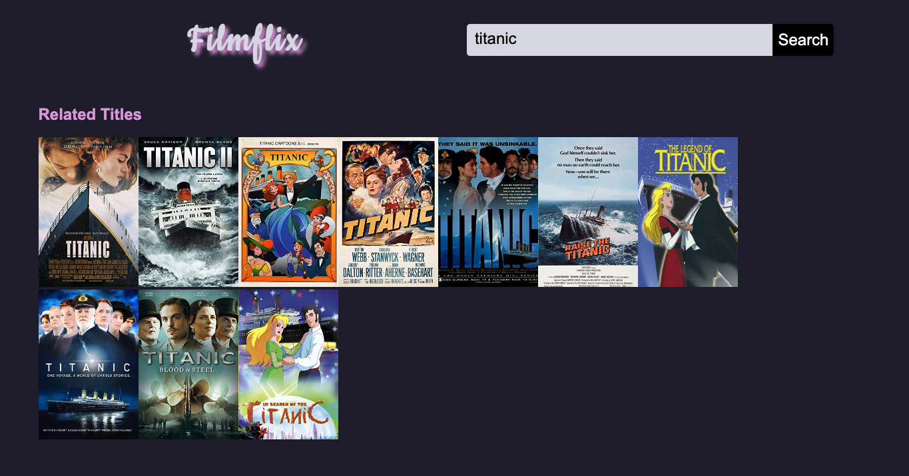

# Filmflix
Week 7 assignment from General Assembly's Front End Web Development course. Consumed the [OMDB API](http://www.omdbapi.com/) and returned film search matches.

**Homepage**



**Search Button Code**

```
searchBtn.addEventListener("click", function(event) {
    event.preventDefault()
    movieList.innerHTML = ""
    h2.textContent = "Related Titles"
    //1. access the user input from input tag
    var movieInput = document.querySelector("#user-input")
    //2. send a request behind the scenes to OMDBAPI 
    var url = "http://www.omdbapi.com/?s=" + movieInput.value + "&apikey=2f6435d9"
    // axios library function, special syntax
    axios.get(url).then(function(response) {
        //array called movies
        var movies = response.data.Search
        for (var i = 0; i < movies.length; i++) {
            movieList.innerHTML += `<li></li>`
        }
    })
})
```

Deployed [here](https://penelopecj.github.io/filmflix/).